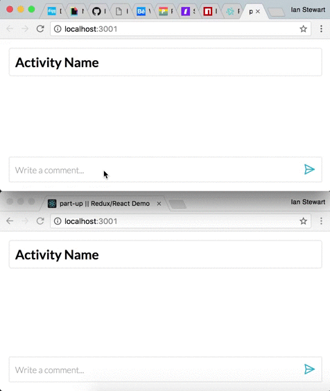

# Part-up Redux/ React demo
> Demoing the activity tab comment-page with redux and react-redux

## The App

This app is a demo of the possibilities with Redux and React. I have rebuilt the activity tab comment section for this component rebuild demo. The components came from a MeteorJS base.

## Cloning
Clone the repo:
```
$ cd ~/Sites && git clone git@github.com:IanCStewart/minor-part-up.git
```

Install the node modules:
```
$ cd minor-part-up && npm i
```

## Deploying
Run server in first terminal window:
```
$ npm run start-server
```

Run the client in a second terminal window:
```
$ npm start
```
